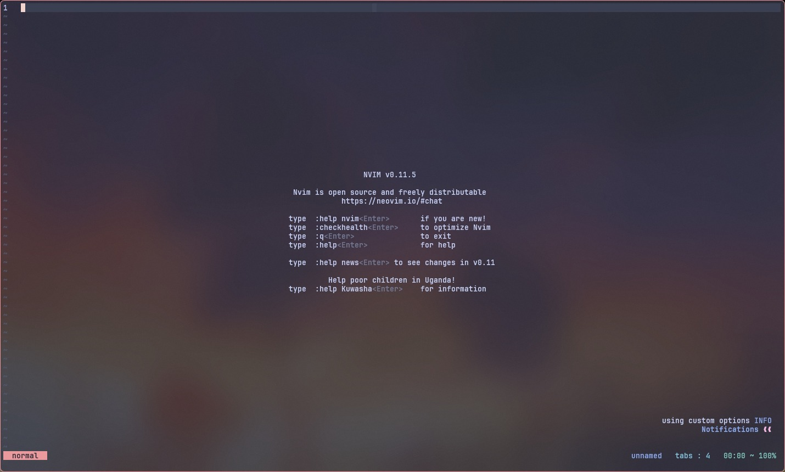
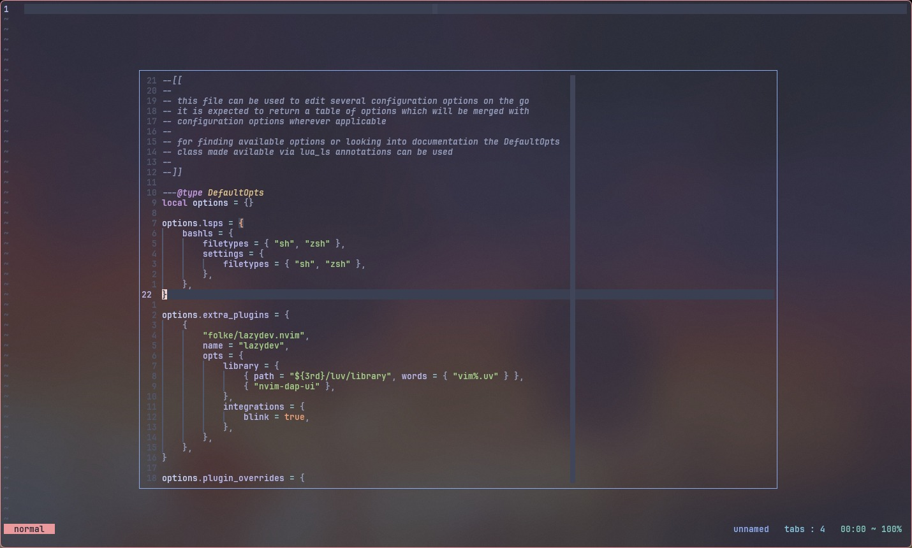
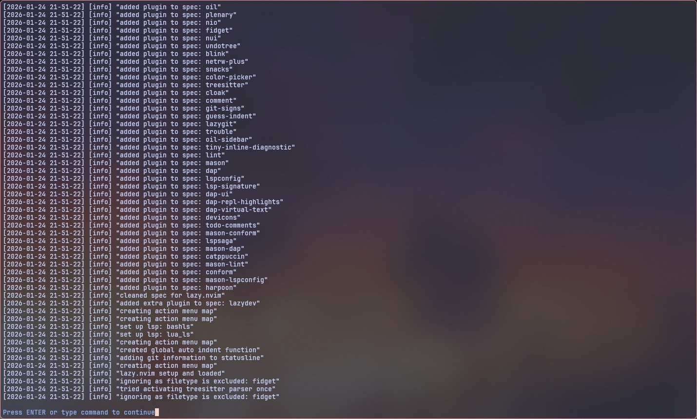
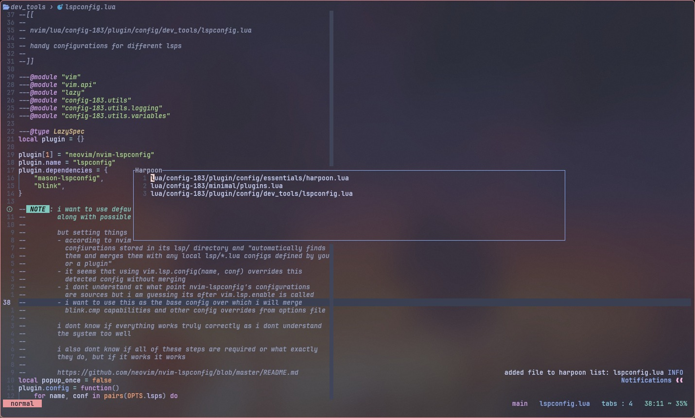
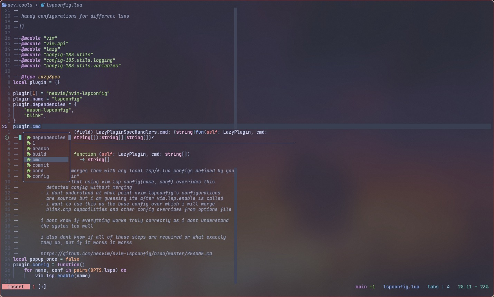
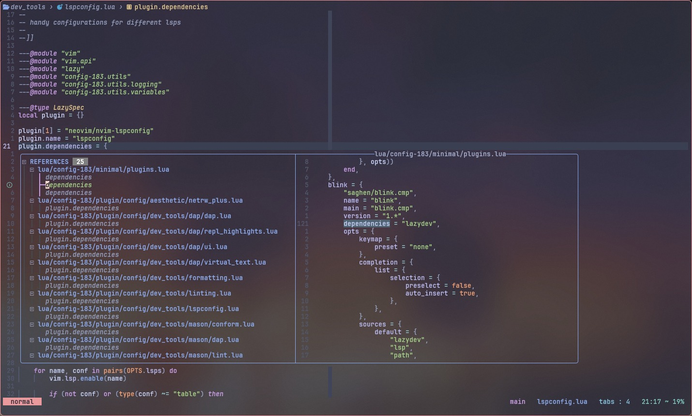
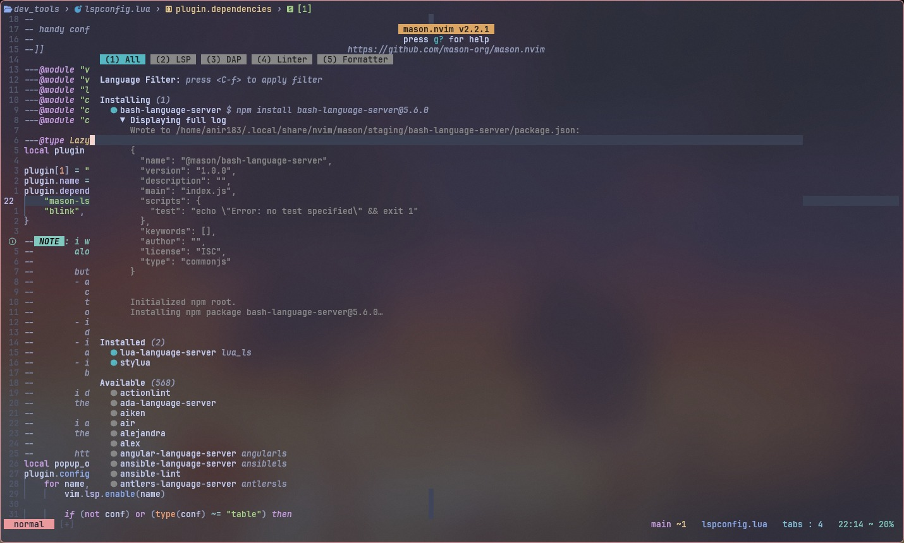
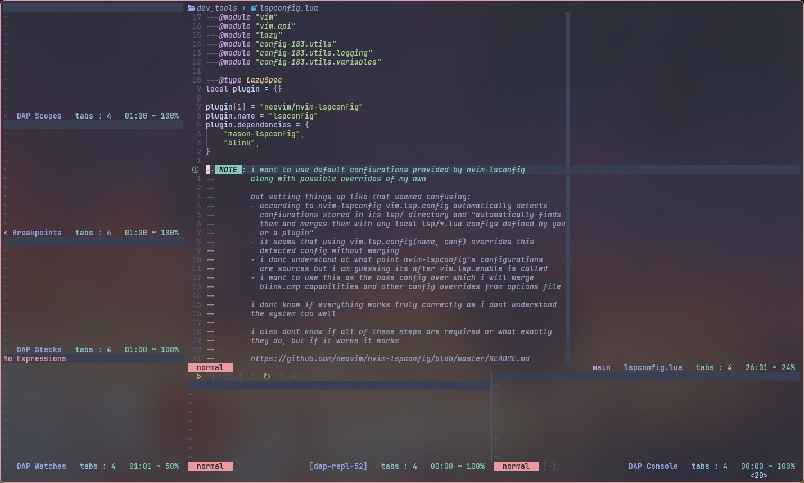
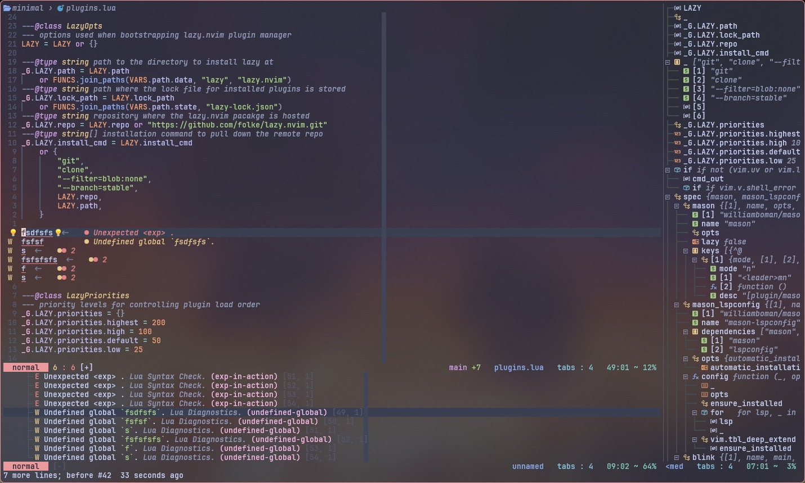

# config.nvim
my custom neovim configuration complete with some pretty good keymaps, some
handy custom functionality and awesome plugins.
<br>
i generally try to keep my config simple and minimal, but i had some time on my
hands and wanted to see how much i could over-engineer the config. and this was
the result.
<br>

<br>

### features
this config has some pretty handy features -
* handy keymaps, good options and the whole 100 yards
* custom editable options file which can be opened in a floating buffer and
edited on the fly
* multiple modes: normal, minimal, minimal with plugins, normal no plugins for
different situations that may arise
* netrw as a fullscreen and sidebar explorer (oil.nvim if plugins are enable)
* custom statusline with mode, diagnostics, git info, file details, etc
* diagnostics, lsp, formatting, linting and debugging via plugins
* fuzzy file search, grep, terminals and other handy utility
* dev tools installation via mason and related tools
<br>

### screenshots
* startup page
<details>
    <summary>image</summary>
    
</details>
<br>
* custom editable options
<br>
<details>
    <summary>image</summary>
    
</details>
<br>
* configuration logging
<br>
<details>
    <summary>image</summary>
    
</details>
<br>
* fuzzy file search
<br>
<details>
    <summary>image</summary>
    
</details>
<br>
* harpoon file switcher
<br>
<details>
    <summary>image</summary>
    
</details>
<br>
* lsp completion
<br>
<details>
    <summary>image</summary>
    
</details>
<br>
* lsp references
<br>
<details>
    <summary>image</summary>
    
</details>
<br>
* mason dev tools installer
<br>
<details>
    <summary>image</summary>
    
</details>
<br>
* dap ui
<br>
<details>
    <summary>image</summary>
    
</details>
<br>
* diagnostics and symbols
<br>
<details>
    <summary>image</summary>
    
</details>
<br>

### config structure
```
.
├── after
├── docs
│   ├── assets
│   │   ├── completion.jpeg
│   │   ├── dapui.jpeg
│   │   ├── diagnostics_and_symbols.jpeg
│   │   ├── fuzzy_files.jpeg
│   │   ├── harpoon.jpeg
│   │   ├── home.jpeg
│   │   ├── logging.jpeg
│   │   ├── mason.jpeg
│   │   ├── options.jpeg
│   │   └── references.jpeg
│   └── README.md
├── ftplugin
├── init.lua
├── LICENSE
├── lua
│   └── config-183
│       ├── base
│       │   ├── autocmds.lua
│       │   ├── init.lua
│       │   ├── keymaps.lua
│       │   ├── logvim.sh
│       │   └── options.lua
│       ├── custom
│       │   ├── commands.lua
│       │   ├── init.lua
│       │   ├── keymaps.lua
│       │   ├── netrw.lua
│       │   └── statusline.lua
│       ├── init.lua
│       ├── minimal
│       │   ├── init.lua
│       │   ├── keymaps.lua
│       │   ├── options.lua
│       │   └── plugins.lua
│       ├── options
│       │   ├── custom.lua
│       │   ├── defaults.lua
│       │   ├── init.lua
│       │   └── template.lua
│       ├── plugin
│       │   ├── config
│       │   │   ├── aesthetic
│       │   │   │   ├── fidget.lua
│       │   │   │   ├── netrw_plus.lua
│       │   │   │   └── theme.lua
│       │   │   ├── dependencies
│       │   │   │   ├── devicons.lua
│       │   │   │   ├── nio.lua
│       │   │   │   ├── nui.lua
│       │   │   │   └── plenary.lua
│       │   │   ├── dev_tools
│       │   │   │   ├── completion
│       │   │   │   │   ├── blink.lua
│       │   │   │   │   └── signature.lua
│       │   │   │   ├── dap
│       │   │   │   │   ├── dap.lua
│       │   │   │   │   ├── repl_highlights.lua
│       │   │   │   │   ├── ui.lua
│       │   │   │   │   └── virtual_text.lua
│       │   │   │   ├── formatting.lua
│       │   │   │   ├── linting.lua
│       │   │   │   ├── lspconfig.lua
│       │   │   │   └── mason
│       │   │   │       ├── conform.lua
│       │   │   │       ├── dap.lua
│       │   │   │       ├── lint.lua
│       │   │   │       ├── lspconfig.lua
│       │   │   │       └── mason.lua
│       │   │   ├── essentials
│       │   │   │   ├── harpoon.lua
│       │   │   │   ├── snacks.lua
│       │   │   │   └── treesitter.lua
│       │   │   └── quality_of_life
│       │   │       ├── ccc.lua
│       │   │       ├── cloak.lua
│       │   │       ├── comment.lua
│       │   │       ├── git_signs.lua
│       │   │       ├── guess_indent.lua
│       │   │       ├── lazy_git.lua
│       │   │       ├── lsp_saga.lua
│       │   │       ├── oil.lua
│       │   │       ├── oil_sidebar.lua
│       │   │       ├── tiny_inline_diagnostics.lua
│       │   │       ├── todo_comments.lua
│       │   │       ├── trouble.lua
│       │   │       └── undotree.lua
│       │   ├── init.lua
│       │   └── spec.lua
│       └── utils
│           ├── functions.lua
│           ├── init.lua
│           ├── logging.lua
│           └── variables.lua
└── queries
    └── dotenv
        └── highlights.sc
```
