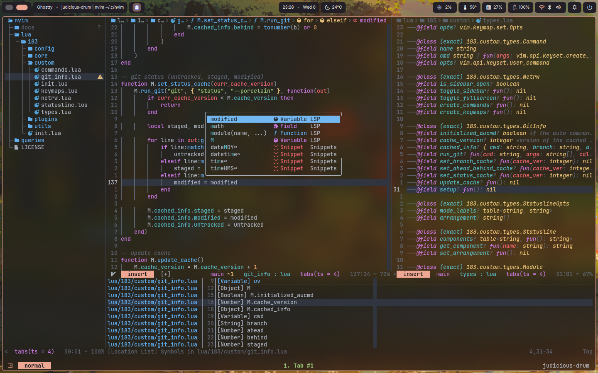

# config.nvim

this is my custom neovim configuration tailored to my workflow... contains many
improvements over whatever i was doing in the last iteration... still quite a
bit of unnecessary complexity but eh.. why not?

after all, i'm just a fool who admired some complexity xD... hopefully wont be
rewriting this too soon.





### features
* fuzzy finder, lsp, dev tools, utilities and the whole 100 yards
* custom statusline... actually custom
* quick options thingy... one stop hub for commonly tinkered options
* multiple modes - minimal, minimal w. plugins, minimal w. devtools, normal and
no-plugins for different scenarios
* relatievely low amount of plugins (35 as of may 6 '26)


# installation
* clone to nvim config directory
    ```
    git clone https://github.com/anir183/config.nvim ~/.config/nvim
    ```
* install dependencies
    ```bash
    pacman -S tree-sitter-cli
    pacman -S fzf
    pacman -S ripgrep          # used for searching by several plugins
    pacman -S npm              # use in mason package installs
    ```


### config
clear separation of concerns -
* 183/init.lua: bootstraps everything and manages mode
* 183/core: sets up or uses only neovim functionality built-in as is
* 183/custom: sets up or uses neovim funcitionality to create new functionality
* 183/config: set and parse common options that can be used quickly on the fly
* 183/plugin: ... plugins ...
* 183/utils: utility functions, constants, etc

every module has a init.lua which bootstraps respectieve submodule... way more
complicated than it needed to be..


```
.
├── docs
│   ├── README.md
│   └── screenshot.png
├── LICENSE
├── lua
│   └── 183
│       ├── config
│       │   ├── custom.lua
│       │   ├── defaults.lua
│       │   ├── example.lua
│       │   ├── merged.lua
│       │   └── types.lua
│       ├── core
│       │   ├── autocmds.lua
│       │   ├── init.lua
│       │   ├── keymaps.lua
│       │   ├── lsp_keymaps.lua
│       │   ├── options.lua
│       │   └── types.lua
│       ├── custom
│       │   ├── commands.lua
│       │   ├── git_info.lua
│       │   ├── init.lua
│       │   ├── keymaps.lua
│       │   ├── netrw.lua
│       │   ├── statusline.lua
│       │   └── types.lua
│       ├── init.lua
│       ├── plugins
│       │   ├── categories
│       │   │   ├── aesthetics
│       │   │   │   ├── fidget.lua
│       │   │   │   └── onedark.lua
│       │   │   ├── dependencies
│       │   │   │   ├── devicons.lua
│       │   │   │   ├── fzf.lua
│       │   │   │   ├── nio.lua
│       │   │   │   └── plenary.lua
│       │   │   ├── dev_tools
│       │   │   │   ├── completion
│       │   │   │   │   ├── blink.lua
│       │   │   │   │   ├── friendly_snippets.lua
│       │   │   │   │   └── luasnip.lua
│       │   │   │   ├── conform.lua
│       │   │   │   ├── dap
│       │   │   │   │   ├── dap.lua
│       │   │   │   │   ├── mason.lua
│       │   │   │   │   ├── ui.lua
│       │   │   │   │   └── virtual_text.lua
│       │   │   │   ├── lint.lua
│       │   │   │   ├── lspconfig.lua
│       │   │   │   ├── lsp_signature.lua
│       │   │   │   └── mason.lua
│       │   │   ├── essentials
│       │   │   │   ├── oil.lua
│       │   │   │   ├── quicker.lua
│       │   │   │   ├── snacks.lua
│       │   │   │   ├── treesitter_manager.lua
│       │   │   │   └── undotree.lua
│       │   │   ├── quality_of_life
│       │   │   │   ├── bqf.lua
│       │   │   │   ├── ccc.lua
│       │   │   │   ├── cloak.lua
│       │   │   │   ├── comment.lua
│       │   │   │   ├── dropbar.lua
│       │   │   │   ├── git_signs.lua
│       │   │   │   ├── harpoon.lua
│       │   │   │   ├── sleuth.lua
│       │   │   │   ├── tiny_inline_diagnostics.lua
│       │   │   │   └── todo_comments.lua
│       │   │   └── toolchains
│       │   │       └── lazydev.lua
│       │   ├── init.lua
│       │   ├── spec.lua
│       │   └── types.lua
│       └── utils
│           ├── constants.lua
│           ├── functions.lua
│           └── types.lua
└── queries
    └── dotenv
        └── highlights.scm
```
